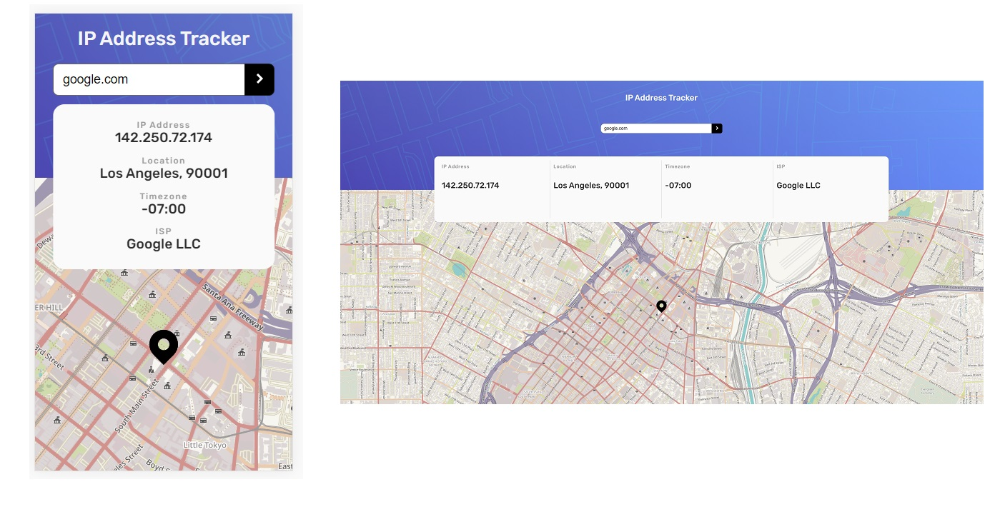

// Failed to load resource: the server responded with a status of 403 ()
-With tiles.stadiamaps.com/tiles/outdoors/{z}/{x}/{y}{r}.png => doesn't work, need api key?

// Tried these tiles but doesn't work because 403(local ok though), need a kind of api key while requesting from stadiamaps.com, see readMe:
// should probably search for tiles with servers/Api allowing more than just local use if wanna test others tiles
// L.tileLayer("https://tiles.stadiamaps.com/tiles/outdoors/{z}/{x}/{y}{r}.png", {
// attribution:
// '&copy; <a href="https://stadiamaps.com/">Stadia Maps</a>, &copy; <a href="https://openmaptiles.org/">OpenMapTiles</a> &copy; <a href="http://openstreetmap.org">OpenStreetMap</a> contributors',
// }).addTo(loadedMap);

// Leaflet icon style
https://leafletjs.com/reference-1.7.1.html#icon

// A Random kitten tile layer
https://leafletjs.com/examples/extending/extending-2-layers.html
“Extension methods”
A few of the Leaflet classes have so-called “extension methods”: entry points for writing code for sub-classes.

One of them is L.TileLayer.getTileUrl(). This method is called internally by L.TileLayer whenever a new tile needs to know which image to load. By making a subclass of L.TileLayer and rewriting its getTileUrl() function, we can create custom behaviour.

Let’s illustrate with a custom L.TileLayer that will display random kitten images from PlaceKitten:

L.TileLayer.Kitten = L.TileLayer.extend({
getTileUrl: function(coords) {
var i = Math.ceil( Math.random() \* 4 );
return "https://placekitten.com/256/256?image=" + i;
},
getAttribution: function() {
return "<a href='https://placekitten.com/attribution.html'>PlaceKitten</a>"
}
});

L.tileLayer.kitten = function() {
return new L.TileLayer.Kitten();
}

L.tileLayer.kitten().addTo(map);
